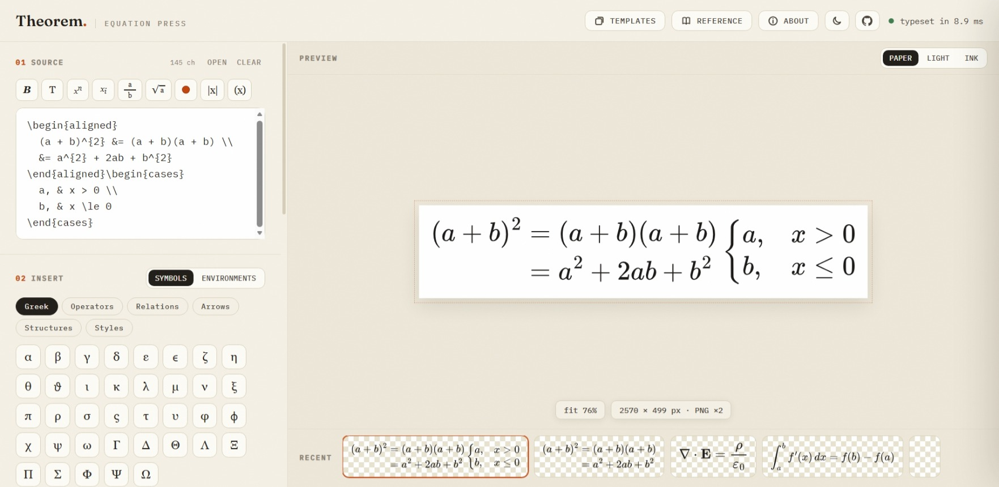

# Theorem — LaTeX to PNG Converter & Equation Image Generator

> **Convert LaTeX to PNG** — render equations live and export transparent PNG, WebP, SVG, JPG or
> true-vector PDF images. Free, private, no signup. Built by [Soumyajit Das](https://github.com/Soumyajit9696).

**[ Homepage ](https://soumyajit9696.github.io/theorem/)** · **[ Try the live app → ](https://soumyajit9696.github.io/theorem/app/)** · **[ Desktop installers ](https://github.com/Soumyajit9696/theorem/releases/latest)**

Theorem is a **LaTeX to PNG / LaTeX to image** converter that runs entirely in your browser.
Type or paste LaTeX, watch it typeset in milliseconds, then press it out as a crisp image for
slides, papers, notes, documentation — or anywhere you need a math equation as an image.

## Why Theorem for LaTeX → PNG?

- **Transparent backgrounds** — exported PNGs keep their alpha channel, so equations drop
  cleanly onto slides, Notion, docs, and dark backgrounds.
- **True vector exports** — standalone SVG and vector PDF (via jsPDF + svg2pdf), crisp at any zoom.
- **Every format** — PNG, WebP, JPG, SVG, PDF at 1–6× resolution, with a live pixel-dimension
  readout before you commit.
- **Smart PNGs** — every exported PNG carries its LaTeX source *inside the file*. Drop it back
  into Theorem on any machine and the editable formula pops back out.
- **Paste & drag anywhere** — copy as a paste-ready image straight into Word, Docs, and Outlook;
  on the desktop app, drag the equation out of the window into PowerPoint or a folder as a file.
- **Full LaTeX environment support** — `equation`, `align`, `gather`, `cases`, `split`,
  the matrix family, and `array` with rules. Pasted fragments with `$$…$$`, `\[…\]`,
  `\label`, `%` comments, even `\documentclass` wrappers just work.
- **Complete customization** — ink color, font size, background, padding, rounded corners,
  frame presets, and per-selection coloring with its own palette.
- **Fast and private** — rendering is MathJax 3 in your browser. Nothing is uploaded anywhere.
- **Zero setup** — no build step, no backend, no account.

## Everything inside

| Feature | Details |
|---|---|
| ⌨️ **Live typesetting** | MathJax 3 SVG output with a millisecond render timer |
| 🧠 **Inline autocomplete** | Type `\` + letters, `Tab` completes — environment skeletons included |
| 📚 **40+ templates** | Calculus, linear algebra, probability, physics, chemistry, environments |
| 📖 **Quick reference** | ~160 commands with rendered examples, searchable, click-to-insert |
| 🧰 **Symbol palette** | Greek, operators, relations, arrows, structures, styles |
| 🎨 **Selection color** | Highlight parts of an equation, independent of the main ink |
| 📋 **Clipboard** | Paste-ready image, SVG markup, LaTeX source, base64 data URI, share links |
| 📂 **.tex files** | Open, save, and drag-and-drop `.tex` directly onto the editor |
| 🌓 **Dark & light themes** | Persisted, no flash on load |
| 🕘 **Render history** | Recent equations remembered across sessions |
| 🖥️ **Desktop edition** | Windows / macOS / Linux — native menus, status bar, drag-out, auto-updates |

## Keyboard shortcuts

| Shortcut | Action |
|---|---|
| `Ctrl/⌘ + S` | export in the current format |
| `Ctrl/⌘ + ⇧ + C` | copy PNG (paste-ready) |
| `Ctrl/⌘ + D` | duplicate line |
| `Ctrl/⌘ + /` | comment / uncomment line |
| `Tab` | accept autocomplete |
| `Esc` | close panels |

## FAQ

### How do I convert LaTeX to PNG?

Open the [live app](https://soumyajit9696.github.io/theorem/app/), type or paste your LaTeX, and press
**Export PNG**. Set the resolution from 1× to 6×, pick the ink color, and choose a transparent or
colored background before exporting.

### Can I export LaTeX equations with a transparent background?

Yes — choose the **Transparent** background mode and the PNG keeps its alpha channel. JPEG has no
alpha, so transparent backgrounds are filled white in `.jpg` exports. WebP keeps transparency too.

### Is Theorem free, and does it upload my equations?

Theorem is completely free (MIT license) and runs entirely in your browser. Nothing you type is
uploaded anywhere; settings live only in your own browser's localStorage.

### Which formats can I export?

PNG, WebP, JPG, SVG (standalone vector), and PDF (true vector when svg2pdf is available, otherwise
rasterized at your chosen scale). You can also copy a base64 data URI for embedding in HTML/CSS,
or a share link that carries the equation in the URL.

## Run it locally

Web app — no build step, just open `app/index.html`, or serve the folder:

    git clone https://github.com/Soumyajit9696/theorem.git
    cd theorem
    npx serve .

Desktop app:

    cd desktop
    npm install
    npm start            # dev mode
    npm run dist:win     # build installers (also :mac, :linux)

### Deploy on GitHub Pages

1. Push this repository to GitHub.
2. **Settings → Pages → Source: Deploy from a branch → `main` / `(root)`**.
3. Homepage at `https://soumyajit9696.github.io/theorem/`, app at `/theorem/app/`.

### Desktop releases

Push a tag (`v1.0.0`) or create a release on GitHub — the Actions workflow builds
`Theorem-Setup.exe`, `Theorem.dmg`, and `Theorem.AppImage` automatically and attaches them
to the release. Installed apps self-update from new releases.

## Project structure

    theorem/
    ├── index.html                  landing page (homepage)
    ├── sw.js                       one-time cache cleanup worker
    ├── app/                        web app (GitHub Pages)
    │   ├── index.html
    │   ├── style.css
    │   ├── script.js
    │   └── assets/
    ├── desktop/                    Electron desktop edition
    │   ├── main.js · preload.js · package.json
    │   ├── build/icon.png
    │   └── renderer/
    │       ├── index.html · style.css · script.js
    │       ├── desktop-app.js      Windows skin, custom menus, native glue
    │       └── vendor/             MathJax, jsPDF, svg2pdf (offline)
    ├── .github/workflows/desktop-release.yml
    ├── robots.txt · sitemap.xml
    └── LICENSE

## Tech & credits

- [MathJax 3](https://www.mathjax.org/) — TeX → SVG typesetting
- [jsPDF](https://github.com/parallax/jsPDF) + [svg2pdf.js](https://github.com/yWorks/svg2pdf.js) — PDF export
- [Fraunces](https://fonts.google.com/specimen/Fraunces) & [IBM Plex](https://fonts.google.com/specimen/IBM+Plex+Sans) — typography

## Author

**Soumyajit Das** — [GitHub](https://github.com/Soumyajit9696) · [Theorem repo](https://github.com/Soumyajit9696/theorem)

## License

MIT — see [LICENSE](LICENSE).
